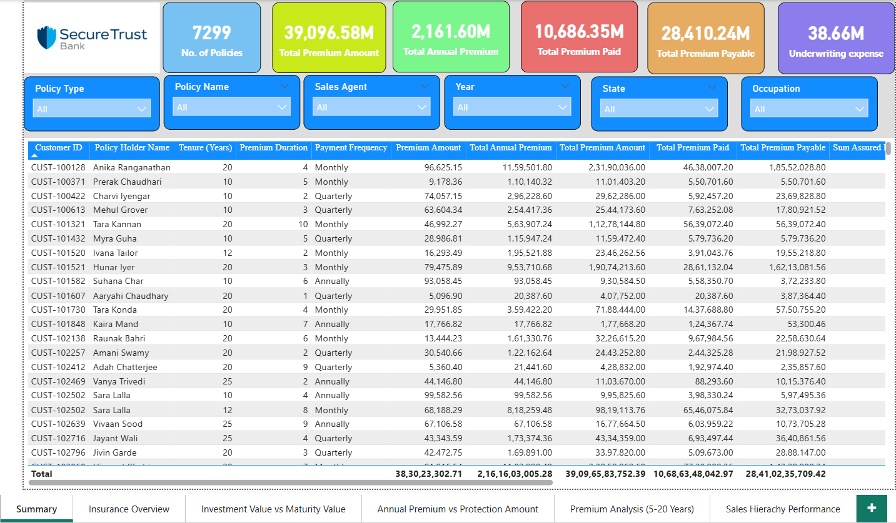

# 📊 End-to-End Insurance Analytics Dashboard | Power BI

---

## 🚀 Project Overview
This project demonstrates the development of an **End-to-End Insurance Analytics Dashboard** built using **Power BI** to transform raw insurance data into actionable business insights.

The solution integrates multiple datasets into a centralized Business Intelligence system enabling stakeholders to monitor policy performance, investment growth, premium trends, and sales hierarchy performance.

The project follows an industry-level BI workflow:

**Data Source → Data Modeling → DAX Development → Dashboard Design → Business Insights**

---

## 🎯 Business Problem
Insurance organizations generate large volumes of policy and operational data but often lack a unified analytics platform.

### Key Challenges:
- ❌ No centralized KPI visibility  
- ❌ Difficulty tracking premium vs protection coverage  
- ❌ Limited investment maturity insights  
- ❌ Lack of sales hierarchy performance monitoring  
- ❌ Manual reporting processes  

✅ The objective was to design an interactive dashboard supporting **data-driven decision making**.

---

## 🗂 Data Sources
The project uses multiple CSV datasets representing insurance business operations:

- 📄 Insurance Policy Data  
- 👤 Customer Details  
- 🏷 Policy Type  
- 🛡 Policy Protection Plan  
- 🧑‍💼 Agent Data  
- 📍 Zonal Manager Data  
- 🌍 Regional Manager Data  

---

## 🧩 Data Modeling Approach

A **Star Schema Data Model** was implemented for optimized analytics performance.

### 📌 Fact Table
- **Insurance Policy Table**

### 📌 Dimension Tables
- Customer Details  
- Policy Type  
- Policy Protection Plan  
- Agent  
- Zonal Manager  
- Regional Manager  

### ⚙ Model Design Principles
- ✔ Many-to-One relationships  
- ✔ Optimized filtering performance  
- ✔ Dedicated Measure Table  
- ✔ Enterprise BI semantic modeling practices  

---

## ⚙️ Technical Implementation

### 🔹 Data Preparation
- Data cleaning using Power Query  
- Data transformation & validation  
- Relationship modeling  
- Hierarchical structure creation  

### 🔹 DAX Development
Developed business measures including:

- 💰 Total Annual Premium  
- 📊 Premium Paid & Payable Metrics  
- 🛡 Protection Amount Analysis  
- 📈 Investment vs Maturity Value Comparison  
- 📅 Annual Growth Metrics  
- 📉 ROI Calculations  
- 💼 Expense Monitoring KPIs  

---

## 📊 Dashboard Pages

### 🧾 Summary
Executive overview presenting high-level insurance KPIs.

### 🏢 Insurance Overview
Comprehensive view of policy distribution and business performance.

### 💰 Investment Value vs Maturity Value
Comparison of investment growth against maturity outcomes.

### 📈 Annual Premium vs Protection Amount
Analysis of premium contribution relative to protection coverage.

### ⏳ Premium Analysis (5–20 Years)
Long-term premium trend analysis across policy durations.

### 👥 Sales Hierarchy Performance
Performance tracking across:
- Agents  
- Zonal Managers  
- Regional Managers  

---

## 📈 Key Business Outcomes
- ✅ Centralized insurance KPI monitoring  
- ✅ Improved visibility into investment performance  
- ✅ Identification of high-performing sales regions  
- ✅ Premium vs protection optimization insights  
- ✅ Faster business decision-making  

---

## 🧠 Skills Demonstrated
- Power BI Development  
- Star Schema Data Modeling  
- Many-to-One Relationship Design  
- DAX & KPI Development  
- Business Intelligence Reporting  
- Insurance Domain Analytics  
- Data Storytelling  
- Dashboard Optimization  

---

## 📁 Repository Structure
Dataset/

Documentation/

Dashboard Screenshots/

DAX Measures/

PBIX File/

README.md

---

## 📷 Dashboard Preview

---

## 📂 Project Files
- 📁 **Dataset** → Source CSV files  
- 📁 **Documentation** → Business & model explanation  
- 📁 **DAX Measures** →  Measure Table  
- 📁 **PBIX File** → Complete Power BI dashboard  

---

## 👨‍💻 Author
**Ayush Junghare**  
📊 Aspiring Data Analyst | Power BI Developer  

Open to opportunities in **Data Analyst / Power BI Analyst** roles.

---
## 🤝 Let's Connect
If you found this project interesting or would like to collaborate:

🔗 LinkedIn: linkedin.com/in/ayush-junghare-52458527a

---

## ⭐ Support
If you find this project useful, please consider giving this repository a ⭐.

---

## 🔖 GitHub Topics

powerbi

data-analytics

business-intelligence

insurance-analytics

dax

dashboard

